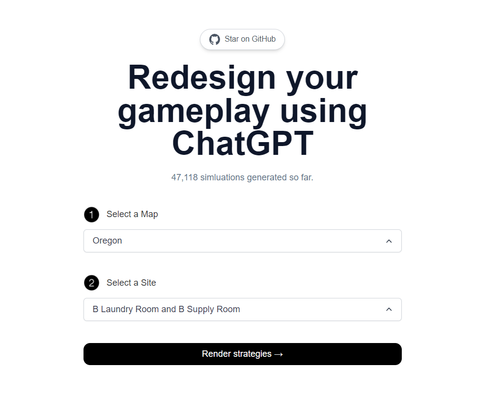

# [SiegeGPT](https://siege-gpt.vercel.app)

This project generates dynamic gameplay suggestions for the popular esport title [Tom Clancy's Rainbow six siege.](https://www.ubisoft.com/en-us/game/rainbow-six/siege) <br/>
Heavily inspired from Nutlope's [Twitter-bio-generator.](https://github.com/Nutlope/twitterbio)

[](https://siege-gpt.vercel.app)

## How it works

This project uses the [ChatGPT API](https://openai.com/api/) and [Vercel Edge functions](https://vercel.com/features/edge-functions) with streaming. It constructs a prompt based on the form and user input, sends it to the chatGPT API via a Vercel Edge function, then streams the response back to the application.

## Running Locally

After cloning the repo, go to [OpenAI](https://beta.openai.com/account/api-keys) to make an account and put your API key in a file called `.env`.

Then, run the application in the command line and it will be available at `http://localhost:3000`.

```bash
npm run dev
```

## One-Click Deploy

Deploy the example using [Vercel](https://vercel.com?utm_source=github&utm_medium=readme&utm_campaign=vercel-examples):

[](https://siege-gpt.vercel.app)
